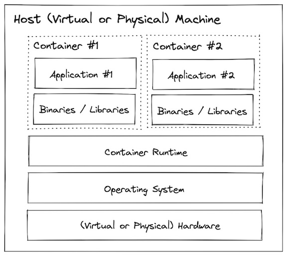

# Docker
Helps create an environement which is as close to a production environment.


# Why containers?
Create dev environment is as easy as ---> "run docker compose up"

## What is a Container?
A docker container image is a standalone, lightweight, executable (SLE) bundle of software which are required to run an application without depending on anything else.

## Open Container Initiative (OCI)
An Open governance structure for express purpose of creating open industry standards around container formats and runtime.
- Runtime Specification
- Image Specification
- Distribution Specification

##  Comparision between bare metal, VM and container
## Bare Metal

1. Hellish dependency conflicts
2. Low utilization efficiency
3. Large blast radius
4. Slow start up & shut down speed (minutes)
5. Very slow provisioning & decommissioning (hours to days)


1. No dependency conflicts
2. Better utilization efficiency
3. Small blast radius
4. Faster startup and shutdown (minutes)
5. Faster provisioning & decommissioning (minutes)



1. No dependency conflicts
2. Even better utilization efficiency
3. Small blast radius
4. Even faster startup and shutdown (seconds)
5. Even faster provisioning & decommissioning (seconds)
6. Lightweight enough to use in development!


## Technology Overview
3 core technologies of Docker:
- Namespaces
- Control Group
- Union Filesystem

### Namespace
A namespace wraps global system resource in an abstraction that makes it appear to the processes within a namespace that they have their own isolated instance of thr global resource.

Changes to the global resource are visible to other processes that are member of the namespace, but are invisible to other processes.

Example: PIDs, basically when we see what processes are running on the container, we will not be able to see what all is running on the host which is hosting the container. By this, we are securing the processes and info about anything running on the host.

### Cgroups
A linux kernel feature which allow processes to be organized into heirarchical groups whose usage of various types of resources can be limited and monitored.

Basically tells what process uses how much is the consumption.
This is important so that we can isolate different processes and each of our different applications.

Using cgroups, we can configure which process should be able to access hosts resources

Example: 
Application A usee 30% of CPU cycles.
Application A uses up to 50MB memory.

Application B uses 40% of CPU cycles.
Application B use up to 100MB memory.


### Union Mount FileSystems(overlayfs)
Allows files and directories of separate file systems, known as branches

# Docker architecture


# Commands
## Running first container
docker run docker/whalesay cowsay "Hey Hiring Team, Sunny is a good DevOps engineer who likes new technologies"

## Getting postgres running fr our project
docker run --env POSTGRES_PASSWORD=foobarbaz --publish 5432:5432 postgres:15.1-alpine

We are passing the password for Postgres in POSTGRES_PASSWORD as an environment variable.
We are also telling that there is a port called 5432 with which we can access the Postgres instance which will running on the isolated network from the host and the second 5432 is the port on the container.
And finally, we mention which version of POstgres we want.


## Understanding container Data with Container
Default behavior: All data created or modified in container will be lost if container is stopped/deleted. 
## Solution
If we want some data to be present everytime a container image is run, it should be built into the image itself.


If we want data generated or modified by container to be **persistant**, we should use a volume to store that outside of the container file system. 
OR, we could use **DOCKER VOLUME**.


# Some practical
Creating a container from the Ubuntu image
**docker run --interactive --tty --rm ubuntu:22.04** 

--interactive and --tty helps us to get the shell to interact with the Ubuntu container
-rm removes the container from the host once we exit the shell and does not keep the image of the container which we created.

Updating the OS
```apt update```

Installing the ping utility

To get ping utility
```apt install iputils-ping```

Test
```ping google.com -c 1```


Now, running the same command without rm and giving the container name this time:
**docker run --interactive --tty --name sunny-ubuntu-container ubuntu:22.04**
Updating the OS
**apt update**


**Start the container again**
```docker start sunny-ubuntu-container```

**Attach command to go into the container shell**
```docker attach sunny-ubuntu-container```

Problem: everytime we build the container using the container image, we have to update it and install the iputils command. This is not efficient. Hence, we build a container image of our own.

**Build a container image with Ubuntu image as base image and ping installed**

```
docker build --tag sunny-ubuntu-image -<<EOF
FROM ubuntu:22.04
RUN apt update && apt install iputils-ping --yes
EOF
```

This way we are persisting the data and the changes whcih we are making in the container image.
The FROM... RUN... stuff is part of what is called a Dockerfile that is used to specify how to build a container image.


**Running the new container**
``` docker run -it --rm sunny-ubuntu-image ```
Now, whatever files we create inside this will not perish as it in not on persistant volume.

### To compare image and the the container which we created
```
docker diff sunnycontainer
```
# Ways to Build Image
## Creating an image of the container
```
#Syntax:
docker commit name_of_the_container image_name_which_we_want_to_keep

docker commit sunnycontainer image_sunnyContainer
```

### Create a container using the image we created
```
docker run -it --name new_container image_sunnyContainer /bin/bash
```

### Creating an image using Dockerfile
Dockerfile is a text file and it contains a set of information.
Automation of Docker image creation.

### Docker components
1. FROM- For base image, this command is at the top of the Dockerfile.
2. RUN- To execute  commands, it will create a layer image. It helps to run whetever we write in the Dockerfile.
3. MAINTAINER- Author/Owner/Description 
4. COPY- Copy files from the local system(docker VM). We need to provide source, destination. We can't download file from internet.
5. ADD- Similar to copy, it provides a feature to copy from the Internet, also extract file at docker image side.
6. EXPOSE- To expose ports, such as 8080 for tomcat, springboot app, nginx etc.
7. WORKDIR- To set working directory for a container.
8. CMD- Execute commands but during the  container creation.
9. ENTRYPOINT- Similar to CMD, but has higher priority over CMD. First command will be executed by ENTRYPOINT only.
10. ENV- Environment variables.
11. ARG- ARG variables are a type of Docker environment variable that can be used to pass build-time variables into your Dockerfile.

### Steps to Creating a container using Dockerfile
1. Create a Dockerfile
2. Add the configuration to it
3. Run build -t myimage .
4. docker ps -a
5. docker images
6. Create a container:
   1. Use command-> docker run --it --name myContainer myimage /bin/bash
   
### Creating a sample Dockerfile

```
FROM ubuntu
WORKDIR /tmp
RUN echo "This is a sample container created from Dockerfile">/tmp/sunny.txt
ENV myname SunnySingh
COPY testfile1 /tmp
ADD test.tar.gz /tmp
```
# Docker Volume
Docker Volume is a directory in which we could store data and make it persistant and also share it with other containers.
- Volume will persist even if we delete the container.
- It allows us to share nything from host to container.
- First we have to declare a directory as a Volume and then share the volume with containers.
- Volume will be created in one container and then share it with others.We can declare a directory as a Volume ONLY WHILE CREATING CONTAINER.
- We CAN'T create a volume from a existing container. 
- We can share one volume across any number of containers. 
- Volume will not be included when we update an image.
- We can map volume in two ways:
  - Container <-> Container
  - Host <-> Containe

## Benefits of Docker Volume
1. Decoupling congtainer from storage.
2. Share volume among different containers.
3. Attach Volume to containers.
4. On deleting container volume does not delete.

## Creating a Volume from Dockerfile

1. Create a Dockerfile and write:
   ```
   FROM ubuntu
   VOLUME ["/myVolume1"]
   ```
2. Create image from this Dockerfile:
   ```
   ## -t is for tag name and . is for present directory
   docker build -t my_image .
   ```
3. Now, create a container from the image and run:
   ```
   docker run -it --name container1 myimage /bin/bash
   ```
4. Share volume with another container: Container <-> Container
   ```
   docker run -it --name container2 privileged=true --volumes-from container1 ubuntu /bin/bash
   ```

## Creating Volume using command
docker run -it --name container3 -v /volume2 ubuntu /bin/bash

## Volume(HOST<--->CONTAINER)
'''
#Basically we are saying whetever is put in the ec2-user directory will be mapped to sunny named volume in the container and vice versa
docker run -it --name hostContainer -v /home/ec2-user:/sunny --privileged=true ubuntu /bin/bash
'''

## Some other commands:
```
docker volume ls

docker volume create <Volume-name>

docker volume rm <Volume-name>

#remove all ununsed volumes
docker volume prune

docker inspect <Volume-name>

docker inspect <container-name>

```

## Volume Mounts
We can use volumes and mounts to safely persist the data. 
docker run -it --rm --mount source=my-volume,destination=/my-data/ ubuntu:22.04

``` 
# creating a volume
docker volume create my-volume 
```

### Locating a volume
Fro example, you don't know where the volume was set
```
docker volume inspect my-volume

[
    {
        "CreatedAt": "2024-03-05T13:25:47Z",
        "Driver": "local",
        "Labels": null,
        "Mountpoint": "/var/lib/docker/volumes/my-volume/_data",
        "Name": "my-volume",
        "Options": null,
        "Scope": "local"
    }
]
```


## Container data and Docker Volume
```
# Create a container and mount the volume into the container filesystem
docker run  -it --rm --mount source=my-volume,destination='/c/Users/sunny/IdeaProjects/docker' ubuntu:22.04
# There is a similar (but shorter) syntax using -v which accomplishes the same
docker run  -it --rm -v my-volume:/my-data ubuntu:22.04
```

# Create a container and mount the volume into the container filesystem
docker run  -it --rm --mount source=my-volume,destination=/my-data/ ubuntu:22.04

docker run  -it --rm --mount source=my-volume,destination=/my-data/ ubuntu:22.04
# There is a similar (but shorter) syntax using -v which accomplishes the same
```
docker run  -it --rm -v my-volume:/my-data ubuntu:22.04

```

#  Bind Mounts->Creating a container and mounting the volume from local disk
```
# Create a container that mounts a directory from the host filesystem into the container
docker run  -it --rm --mount type=bind,source="${PWD}"/my-data,destination=/my-data ubuntu:22.04
# Again, there is a similar (but shorter) syntax using -v which accomplishes the same
docker run  -it --rm -v ${PWD}/my-data:/my-data ubuntu:22.04

echo "Hello from the container written by Sunny from inside containerhiit!" > /my-data/hello.txt

# You should also be able to see the hello.txt file on your host system
cat my-data/hello.txt
exit
```


# Docker Port Expose
Container does have any I.P. Adresses.
To access anything from the Internet, the way to do so is to use an IP.
We have logical ports: 0-65535
Logical ports-> Ports which could be assigned to do a particular tasks/access and by default are open.

## Steps to expose port

1. sudo su
2. service docker start
                          host container:container port
3. docker run -td --name techserver - 80:80 ubuntu 
4. docker ps
5. docker port techserver--> This command tells which all ports are open and available
   1. Output: 80/TCP--->0.0.0.0/80
6. docker exec

Difference between -p(publish) and expose
-p allows the port to be exposed to the whole world. While, expose only allows other container in the same docker service.

## 3 options for ports
1. Neither specify expose nor -p
2. Only spcify expose.
3. specify expose and -p


